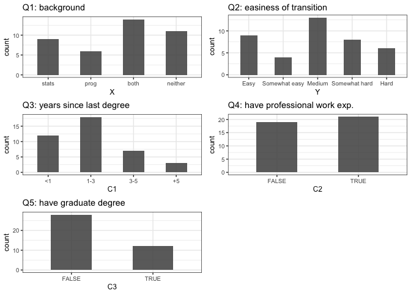
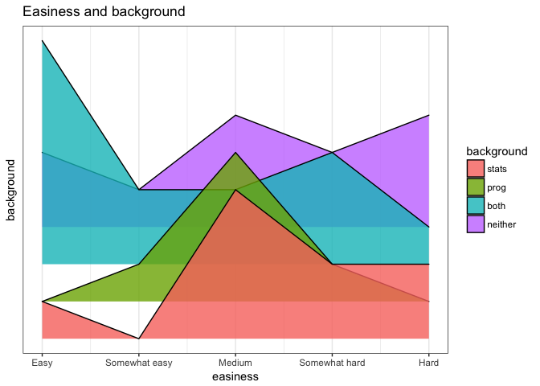
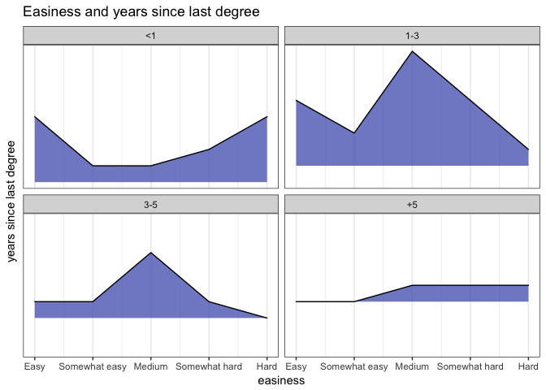
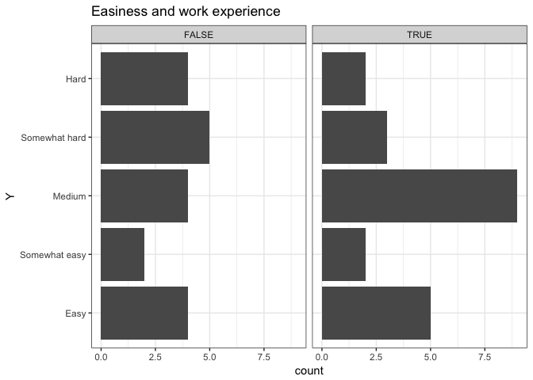
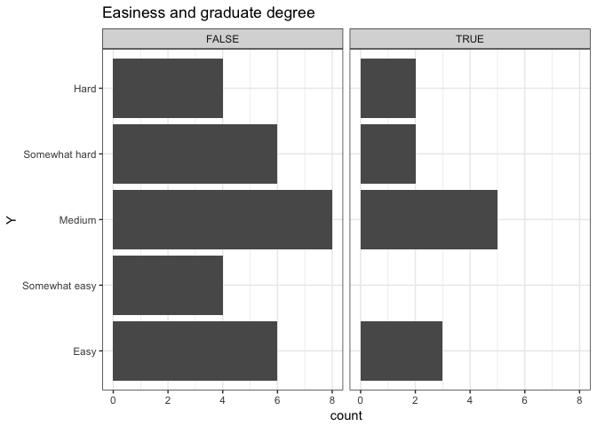
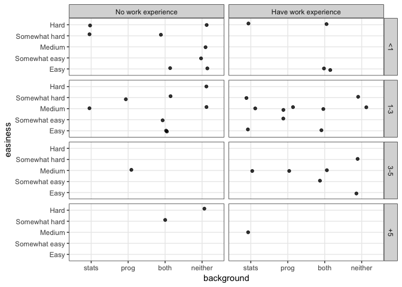
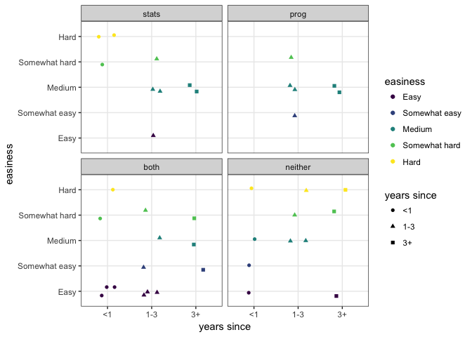

Introduction
------------

The objective of the [2DSCI survey](https://github.ubc.ca/ubc-mds-2017/2DSCI) is to study whether a student's background - statistical or computer science - affects the ease of his/her transition into data science. This document provides the exploratory data analysis of the survey. We will summarize the distribution of the answers to each survey question, and explore the correlation between the response and explanatory variables.

Data
----

The data collected from the survey is located [here](https://github.ubc.ca/ubc-mds-2017/2DSCI/tree/master/data/). The following describes the variables in the data, where X denotes the exploratory variable, Y denotes the response, and C's are the confounding variables identified in the [proposal](https://github.ubc.ca/ubc-mds-2017/2DSCI/blob/master/proposal.md):

<table style="width:54%;">
<colgroup>
<col width="45%" />
<col width="4%" />
<col width="4%" />
</colgroup>
<thead>
<tr class="header">
<th>Question</th>
<th>Label</th>
<th>Type</th>
</tr>
</thead>
<tbody>
<tr class="odd">
<td>Prior to your introduction to Data Science, which of these statements best describes your background?</td>
<td>X</td>
<td>Categorical</td>
</tr>
<tr class="even">
<td>How would you describe your transition into data science?</td>
<td>Y</td>
<td>Categorical</td>
</tr>
<tr class="odd">
<td>How recently have you graduated from your last degree? (in years)</td>
<td>C1</td>
<td>Categorical</td>
</tr>
<tr class="even">
<td>Have you had any experience in professional work environment (not a co-op or internship) prior to your introduction to Data Science?</td>
<td>C2</td>
<td>Binary</td>
</tr>
<tr class="odd">
<td>Did you have another graduate degree prior to your introduction to Data Science?</td>
<td>C3</td>
<td>Binary</td>
</tr>
</tbody>
</table>

In total, we collected data from 40 participants.

Data cleaning
-------------

The collected data has no missing values. The code below loads the data from csv and shortens the values of X for visualization purpose.

``` r
library(tidyverse)
library(plyr)
library(cowplot)
library(forcats)
library(ggridges)
library(viridis)
```

``` r
raw <- read_csv('../data/Assessment.csv')

# remove timestamps and consent
data <- raw %>% select(-Timestamp, -`I agree to the above consent form.`)
```

``` r
# rename columns
colnames(data) <- c('X', 'Y', 'C1', 'C2', 'C3')

# data encoding is needed later for visualization
# mappping for X
maps_X <- tibble(raw=c('I had experience with statistics.',
                        'I had experience with programming.',
                        'I had experience with both programming and statistics.',
                        'I had no more than entry level knowledge of either topic.'),
                  code=c('stats', 'prog', 'both', 'neither'))
# mapping for Y
maps_Y <- tibble(raw=c('Easy', 'Somewhat easy', 'Medium',
                        'Somewhat hard', 'Hard'), code=1:5)
# mapping for C1
maps_C1 <- tibble(raw=c('<1', '1-3', '3-5', '+5'), code=1:4)
# mapping for C2
maps_C2 <- tibble(raw=c('Yes', 'No'), code=c(TRUE, FALSE))
# mapping for C3
maps_C3 <- tibble(raw=c('Yes', 'No'), code=c(TRUE, FALSE))

knitr::kable(maps_X)
```

| raw                                                       | code    |
|:----------------------------------------------------------|:--------|
| I had experience with statistics.                         | stats   |
| I had experience with programming.                        | prog    |
| I had experience with both programming and statistics.    | both    |
| I had no more than entry level knowledge of either topic. | neither |

``` r
# convert X, C2 and C3
data$X <- mapvalues(data$X, maps_X$raw, maps_X$code)
data$C2 <- as.logical(mapvalues(data$C2, maps_C2$raw, maps_C2$code))
data$C3 <- as.logical(mapvalues(data$C3, maps_C3$raw, maps_C3$code))
```

``` r
# relevel data to align with orders in the survey
data$X = data$X %>% fct_relevel('stats', 'prog', 'both', 'neither')
data$C1 <- data$C1 %>% fct_relevel('<1', '1-3', '3-5', '+5')
data$Y <- data$Y %>% fct_relevel('Easy', 'Somewhat easy',
                                 'Medium', 'Somewhat hard', 'Hard')
```

``` r
# cleaned data
knitr::kable(data %>% head)
```

| X       | Y             | C1    | C2    | C3    |
|:--------|:--------------|:------|:------|:------|
| neither | Hard          | &lt;1 | FALSE | TRUE  |
| both    | Easy          | &lt;1 | TRUE  | FALSE |
| both    | Somewhat easy | 1-3   | FALSE | FALSE |
| prog    | Medium        | 1-3   | TRUE  | TRUE  |
| neither | Hard          | +5    | FALSE | FALSE |
| neither | Somewhat easy | &lt;1 | FALSE | FALSE |

``` r
# summary of data
knitr::kable(summary(data))
```

|     |      X     |         Y        |     C1    |       C2      |       C3      |
|-----|:----------:|:----------------:|:---------:|:-------------:|:-------------:|
|     |  stats : 9 |     Easy : 9     | &lt;1 :12 | Mode :logical | Mode :logical |
|     |  prog : 6  | Somewhat easy: 4 |   1-3:18  |    FALSE:19   |    FALSE:28   |
|     |  both :14  |    Medium :13    |   3-5: 7  |    TRUE :21   |    TRUE :12   |
|     | neither:11 | Somewhat hard: 8 |   +5 : 3  |       NA      |       NA      |
|     |     NA     |     Hard : 6     |     NA    |       NA      |       NA      |

Distribution by question
------------------------

This section shows the distribution of the answers to each question to provide an overview of the quality of the collected data.

``` r
t2dsColor <- '#5C6BC0'

#' bar function for reuse
bar_plot <- function(v, title, flip=FALSE) {
  fig <- data %>%
    ggplot() +
    geom_bar(aes_string(v), width=0.5, alpha=0.9) +
    ggtitle(title) +
    theme_bw(base_size = 9)
  if (flip) fig <- fig + coord_flip()
  
  fig
}
```

``` r
# Q1: Prior to your introduction to Data Science, which of
# these statements best describes your background?
q1_plot <- bar_plot('X', 'Q1: background')

# Q2: How would you describe your transition into data science?
q2_plot <- bar_plot('Y', 'Q2: easiness of transition')

# Q3: How recently have you graduated from your last degree? (in years)
q3_plot <- bar_plot('C1', 'Q3: years since last degree')

# Q4: Have you had any experience in professional work 
# environment (not a co-op or internship) prior to your
# introduction to Data Science?
q4_plot <- bar_plot('C2', 'Q4: have professional work exp.')

# Q5: Did you have another graduate degree prior to your
# introduction to Data Science?
q5_plot <- bar_plot('C3', 'Q5: have graduate degree')
```

``` r
plot_grid(q1_plot, q2_plot, q3_plot, q4_plot, q5_plot,
          ncol = 2)
```



Some high-level observations include:

-   48% of the participants have both statistical and programming backgrounds prior to studying data science
-   30% of the participants have neither statistical nor programming background
-   most people find it neither hard nor easy to transition into data science
-   75% of the participants start transitioning to data science within 3 years from getting their last degree
-   half of the participants have professional work experience
-   30% of the participants already have another graduate degree

Pairwise correlations
---------------------

This section explores the correlation between the response and the covariates. Recall that the objective of this survey is to study the correlation between the easiness of transition and one's technical background.

### Easiness vs background

From the joyplot below, participants with both statistical and programming backgrounds find the transition easier. Most participants with one background find the transition not so easy. For participants with no stats or programming background, the distribution is spread out.

``` r
#' get the height required by ggridges
get_heights <- function(v, normalize=FALSE) {
  height <- c()
  for (i in 1:4) {  # for each value in covariate
    filter_criteria <- lazyeval::interp(~col==v, .values=list(col=as.name(v), v=i))
    # filter by covariate
    tmp <- data_encoded %>%
      filter_(filter_criteria)
    # count of each unique response in each group formed by the covariate
    ny <- count(tmp$Y)
    
    for (j in 1:5) {  # for each value in response
      ny2 <- ny %>% filter(x == j)
      if (nrow(ny2) == 0) {
        height <- c(height, 0)
      } else {
        if (normalize) {
          height <- c(height, ny2$freq / nrow(tmp))
        } else height <- c(height, ny2$freq)
      }
    }
  }
  height
}
```

``` r
# encode data to numeric for joyplot
maps_X2 <- tibble(raw=c('stats', 'prog', 'both', 'neither'), code=1:4)

data_encoded <- data %>%
  mutate(Y = mapvalues(data$Y, maps_Y$raw, maps_Y$code),
         X = mapvalues(data$X, maps_X2$raw, maps_X2$code))

# joyplot - easiness vs background
height <- get_heights('X')  # required by ggridges
data_joy <- tibble(Y = rep(1:5, 4),
                   X = c(rep(1, 5), rep(2, 5), rep(3, 5), rep(4, 5)),
                   height = height)
data_joy %>%
  ggplot() +
  geom_ridgeline(aes(Y, X, height=height, group=X, fill=as.factor(X)),
                 alpha=0.8) +
  scale_x_continuous('easiness', breaks=1:5,
                   labels=maps_Y$raw) +
  scale_y_continuous('background', breaks=NULL) +
  scale_fill_discrete('background',
                       breaks=1:4,
                       labels=maps_X2$raw) +
  ggtitle('Easiness and background') +
  theme_bw()
```



### Easiness and years since last degree

It is likely that people who have been away from schools for a long time may find it difficult to go back to study.

``` r
# encode data to numeric for joyplot
data_encoded <- data_encoded %>%
  mutate(C1 = mapvalues(data$C1, maps_C1$raw, maps_C1$code))

# joyplot - easiness vs background
height_C1 <- get_heights('C1')  # required by ggridges
data_joy_C1 <- tibble(Y = rep(1:5, 4),
                      X = c(rep(1, 5), rep(2, 5), rep(3, 5), rep(4, 5)),
                      height = height_C1)
facet_labels <- c(
  '1'=maps_C1$raw[1],
  '2'=maps_C1$raw[2],
  '3'=maps_C1$raw[3],
  '4'=maps_C1$raw[4]
)
data_joy_C1 %>%
  ggplot() +
  geom_ridgeline(aes(Y, X, height=height, group=X),
                 fill=t2dsColor,
                 alpha=0.8) +
  scale_x_continuous('easiness', breaks=1:5,
                   labels=maps_Y$raw) +
  scale_y_continuous('years since last degree', breaks=NULL) +
  scale_fill_discrete('years',
                       breaks=1:4,
                       labels=maps_C1$raw) +
  ggtitle('Easiness and years since last degree') +
  theme_bw() +
  facet_wrap(~X, labeller = labeller(X = facet_labels))
```



The joyplot above shows most people who have graduated for 1-5 years find it not hard to manage the transition. It is interesting to see the plot for new graduates shows two heavy tails on easy and hard. We don't have enough data for people who got their last degree 5+ years ago, so there is hardly any insight in this group. From this plot, it is likely that work experience may affect the easiness of transition.

### Easiness and professional work experience

From the comparison below, most people with professional work experience find it not hard (i.e. easy, somewhat easy or medium) whereas the distribution for the other group is more uniform. Given that the groups with and without work experience are of same size, work experience might have a confounding effect.

``` r
data %>%
  ggplot() +
  geom_bar(aes(Y)) +
  ggtitle('Easiness and work experience') +
  coord_flip() +
  theme_bw() +
  facet_wrap(~C2)
```



### Easiness and graduate degree

Having a graduate degree might not have a strong confounding effect due to the imbalance in group size and similar distributions.

``` r
data %>%
  ggplot() +
  geom_bar(aes(Y)) +
  ggtitle('Easiness and graduate degree') +
  coord_flip() +
  theme_bw() +
  facet_wrap(~C3)
```



Piecing things together
-----------------------

From the pairwise plots, previous graduate degree does not show strong differences in the easiness. The number of years since last degree (C1) and previous work experience (C2) might have confounding effects as they show some difference in the distributions.

C1 and C2 are also correlated. From the plot below, most people who have work experience fall into the `1-3` and `3-5` categories in C1. The Gaussian-like patterns in the groups `1-3` and `3-5` in C1 are likely caused by C2. Either C1 or C2 could be considered in further analysis (e.g. blocking).

``` r
facet_labels <- c(
  'TRUE'='Have work experience',
  'FALSE'='No work experience'
)

data %>%
  ggplot() +
  geom_jitter(aes(X, Y), width=0.15, height=0.15, alpha=0.8) +
  scale_x_discrete('background') +
  scale_y_discrete('easiness') +
  facet_grid(C1 ~ C2, labeller = labeller(C2 = facet_labels)) +
  theme_bw()
```



Remarks from EDA
----------------

-   new grads having a statistical background may find it *hard* to study data science.
-   people with programming background find it neither hard nor easy.
-   new grads with both stats and programming background tend to find it easy.
-   it's not the end of the world if you don't have a stats or CS background but you better start it early.

``` r
# merge group 3-5 and +5 in C1 (years)
maps_regroup <- tibble(raw=c('<1', '1-3', '3-5', '+5'),
                       code=c('<1', '1-3', '3+', '3+'))
data_regroup <- data
data_regroup$C1 <- mapvalues(data_regroup$C1, maps_regroup$raw, maps_regroup$code)

data_regroup %>%
  ggplot() +
  geom_jitter(aes(C1, Y, color=Y, shape=C1), width=0.2, height=0.2) +
  scale_x_discrete('years since') +
  scale_y_discrete('easiness') +
  scale_color_viridis('easiness', discrete = TRUE) +
  scale_shape_discrete('years since') +
  facet_wrap(~X, ncol=2) +
  theme_bw()
```


